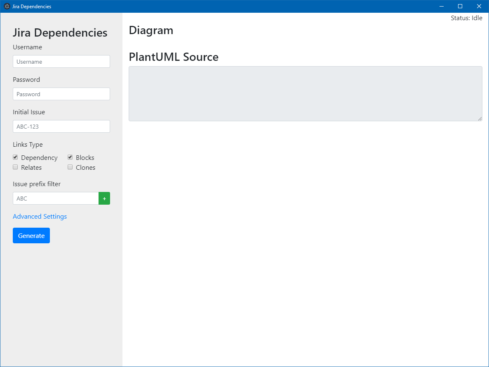

# JiraDependencies

Jira Dependencies diagram generator using PlantUML

## TODO

* [x] Integration with Electron
* [ ] Use local storage to save settings
* [x] Support public or private PlantUML server
* [ ] Diagram title with generation time
* [ ] Put status colors at the begin of the diagram
* [ ] Zoom diagram
* [ ] Highlight starting Issue in the diagram
* [ ] Button to stop the execution
* [ ] Download image
